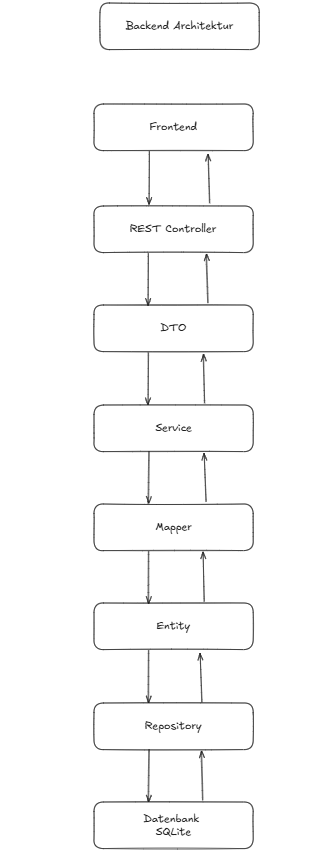
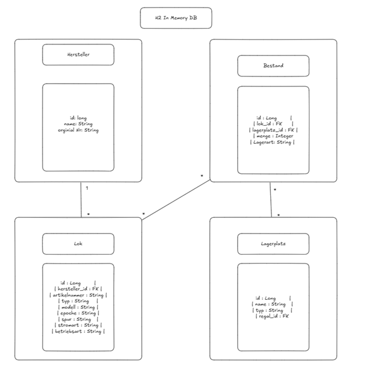

# RailStock-Lagerbewirtschaftungssoftware-Backend

**RailStock Backend** ist der serverseitige Teil der RailStock-Lagerverwaltungssoftware zur Organisation und Verwaltung von Modelleisenbahnbeständen.  
Das Backend basiert auf **Spring Boot** und stellt eine RESTful API bereit, über die das Frontend Daten zu Lokomotiven, Lagerplätzen und Beständen abrufen und verwalten kann.

---

## Technologien

- **Java 21**
- – Moderne, stabile Laufzeitumgebung mit langfristigem Support (LTS)
- **Spring Boot 3.5.6**
- – Framework für den schnellen Aufbau von Microservices und REST-APIs
- **Spring Web**
- – Für die Bereitstellung der REST-Endpunkte
- **Spring Data JPA (Hibernate)**
- – Zur einfachen Datenbankanbindung mit automatischer Objekt-Relationaler Abbildung
- **H2 Database (lokal, persistent)**
- – Gewählt, um eine **einfach einsetzbare Lösung** zu bieten.  
  Dadurch kann das Backend als **fertiges JAR** ausgeliefert und z. B. per USB-Stick an den Bekannten weitergegeben werden.  
  Er kann das Projekt **direkt lokal ausführen und damit arbeiten**, ohne Docker, Git oder eine separate Datenbank installieren zu müssen.  
  Die Daten werden **persistent gespeichert**, sodass sie beim Neustart erhalten bleiben.  
  Später ist ein Wechsel auf MySQL oder PostgreSQL problemlos möglich, falls eine produktive Umgebung eingerichtet wird.
   Die **persistente Speicherung** wird über H2s Dateimodus realisiert:  
  ```properties
  spring.datasource.url=jdbc:h2:file:./railstockdb
  spring.datasource.driver-class-name=org.h2.Driver
  spring.datasource.username=sa
  spring.datasource.password=
  spring.jpa.hibernate.ddl-auto=update

- **Springdoc OpenAPI (Swagger UI)**
- – Automatische Generierung der API-Dokumentation
- **JUnit 5 & MockMVC (Testing)**
- – Für automatisierte Unit- und Integrationstests
- **Maven**
- – Als Build- und Dependency-Management-Tool
- **Insomnia**
- – Zum Testen der API-Endpunkte, indem Requests an:
- ```bash
  http://localhost:8080/api/*
sendet.

---

## Installation & Setup

1. Repository clonen:
   ```bash
   git clone https://github.com/ImeschNico/RailStock-Lagerbewirtschaftungssoftware-Backend.git
   
2. **Über IntelliJ / IDE:**  
Öffnen Sie das Projekt in IntelliJ oder einer kompatiblen IDE und klicken Sie auf den **„Run“ / „Ausführen“-Button**.
Die IDE startet das Backend automatisch im richtigen Arbeitsverzeichnis.

3. API ist erreichbar unter:
   ```bash
   http://localhost:8080/api

--- 

## API Struktur

| Ressource   | Methode | Endpoint                  | Beschreibung                                |
| ----------- | ------- | ------------------------- | ------------------------------------------- |
| Lokomotiven | `GET`   | `/api/loks/filter`               | Liste aller Lokomotiven                     |
| Lokomotiven | `GET`   | `http://localhost:8080/api/loks/filter?herstellerName=Fleischmann`               | Filter nach Modell                  |
| Lagerplatz | `GET`   | `http://localhost:8080/api/lagerplatz/filter?tablar=a01&regal=S01`       | Filter nach Lagerplatz                    |
| Lagerplatz | `POST`   | `http://localhost:8080/api/lagerplatz/erstellen`       | Lagerplatz erstellen                 |
| Bestand    | `PUT`  | `http://localhost:8080/api/bestand/transferBestand` | Transferiert Bestände zwischen Lagerplätzen |
| Bestand   | `PUT`  | `http://localhost:8080/api/bestand/updateBestand` | Bestand Eingang  |

---

## Entwicklung

Das Backend kommuniziert über REST-API mit dem [RailStock Frontend](https://github.com/ImeschNico/RailStock-Lagerbewirtschaftungssoftware-Frontend)
und bildet die zentrale Basis für die Lagerbewirtschaftung.
Ziel ist eine modulare Lösung mit sauberer Trennung von Frontend, Backend und Persistenzschicht.

---

## Architektur



--- 

## ERD



---

## JavaDoc 
**1. JavaDoc generieren**

Terminal öffnen im Projektordner wechseln und:
```bash
# Mit Maven
mvn javadoc:javadoc
```
Die Javadoc Datei wird unter target/site/apidocs erstellt

**2. JavaDoc im Browser öffnen**
- Zu target/site/apidocs/index.html navigieren
- Datei im Browser öffnen:
```bash
# Windows
start target\site\apidocs\index.html
```
Jetzt kann man die gesamte API-Dokumentation durchstöbern


